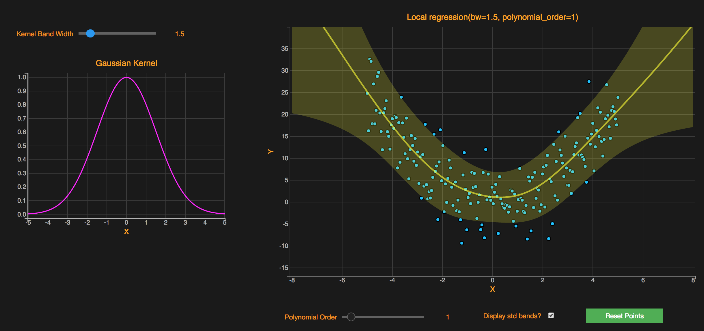
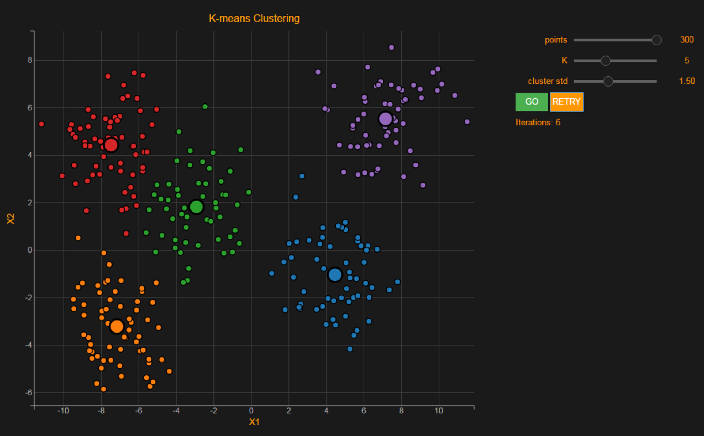
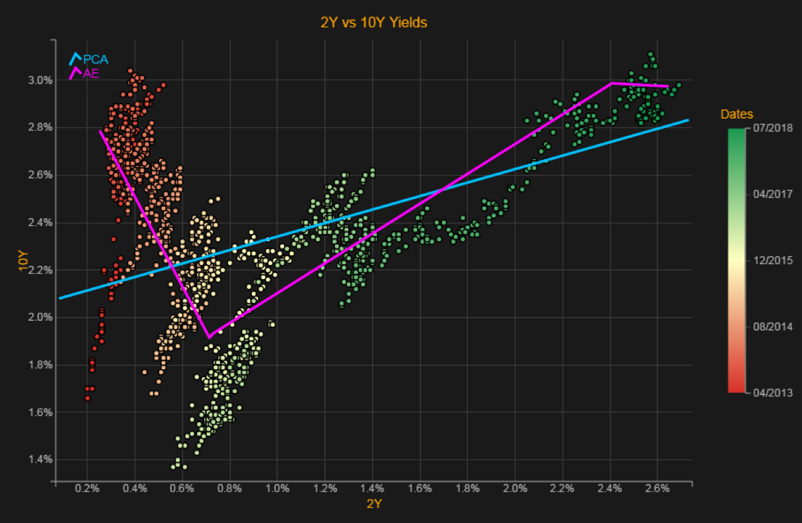
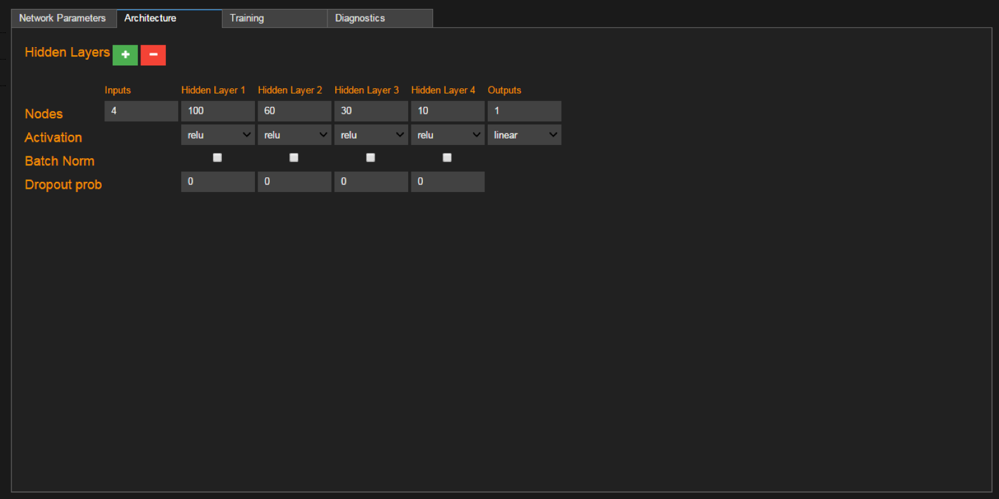
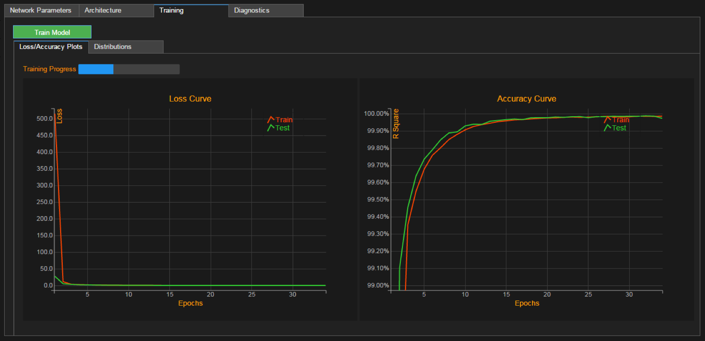
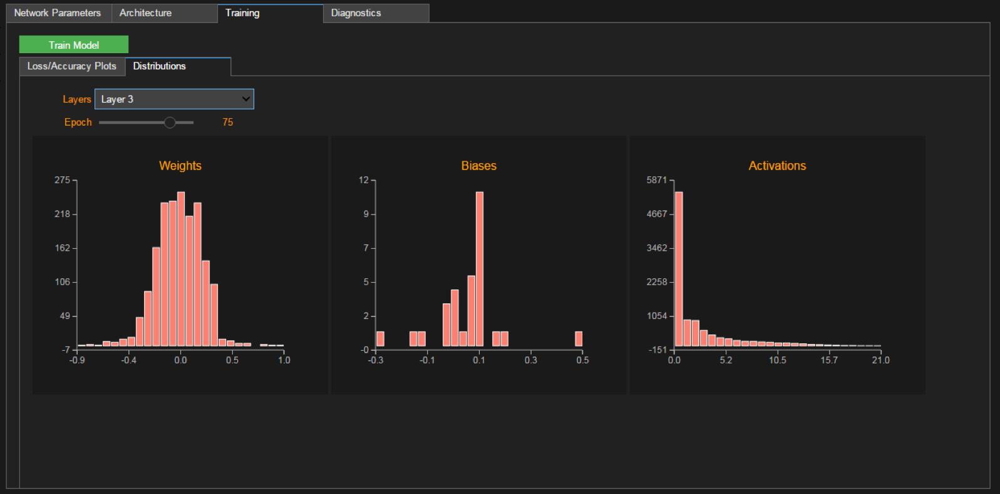

# JupyterCon 2018
Notebooks and code of my 2018 JupyterCon [talk](https://conferences.oreilly.com/jupyter/jup-ny/public/schedule/detail/71406)

## Dependencies

The notebooks and code depend on the following python packages:

- `numpy` (Version 1.13.3)
- `scipy` (Version 1.0.0)
- `pandas` (Version 0.22.0)
- `sklearn` (Version 0.18.1)
- `tensorflow`(Version 1.0.0)
- `keras` (Version 2.0.3)
- `ipywidgets` (Version 6.0.0)
- `bqplot` (Version 0.9.1)

## Notes
All the code should work out-of-the-box (assuming all the dependent libraries are installed). A few things to note:

* All the examples in the talk were run in a black-themed notebook (and black-themed `ipywidgets` and `bqplot`). The colors used in the visualizations and plots were chosen to work well on the black background. Please update the colors (especially lighter colors like yellow) to have them working well in white-themed notebooks. 
* Special add-ons like full-screen button etc. were used to render the visualizations on a full screen. These are not available by default in the classic Jupyter notebook.

(Hopefully with Jupyterlab black-themed notebooks and widgets become available for all!)

The following models/algorithms/tools were covered in the talk:
* Kernel Regression

* K-Means Clustering

* Dimensionality Reduction (PCA vs Autoencoder)

* Neural Network Builder

